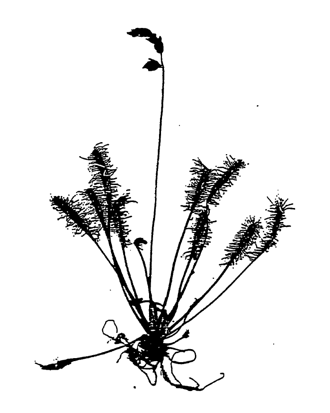
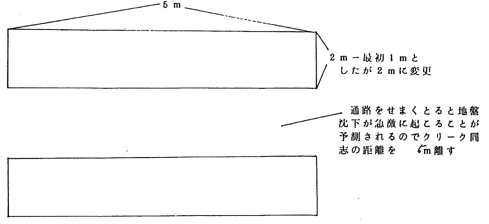
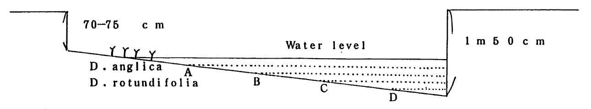
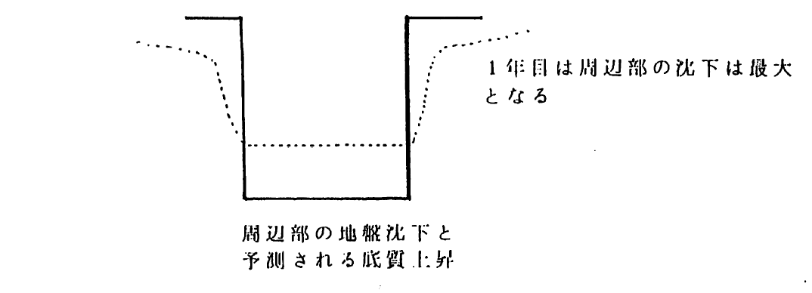

# 浜頓別食虫植物研究会会誌
平成11年6月20日第1号(1999.06.20)の一部を転載した。誤字は修正した。

ナガバノモウセンゴケ、頓別原野にて（採集者　植松 茂）
***
## 浜頓別食虫植物研究会の発足を祝す
食虫植物研究会会長　小宮 定志

道北の浜頓別町に「浜頓別食虫植物研究会」が設立されたとの朗報を受けまして、心からご同慶に存じます。しかも、その設立の目的がナガバノモウセンゴケ・ヤチコタヌキモを絶滅から守ろうという切実な願いにあると拝聴し、益々心からの敬服を禁じ得ません。近年、開発の名を借りて自然破壊が公然と進められている現状をしばしば見せつけられています。そうした風潮の中で、しかも、町レベルで２、３の特殊植物の保護活動を実施することは大変困難を伴うわけです。

今回、浜頓別町で敢てその困難に立ち向われる皆様が〃研究会〃組織を作られて実践活動を開始されることに心から声援を送ります。

国指定天然記念「成東・東金食虫植物群落」（千葉県）、「宝蔵寺沼ムジナモ自生地」（埼玉県羽生市）や愛知県指定天然記念物「壱町田湿地植物群落」（武富町）、「豊橋市ナガバノイシモチソウ自生地」などでも既に地域ボランティア組織をつくり食虫植物の保護と増殖に取組んでおり、大きな成果を挙げております。国や県は指定し放しで、保護、管理は地元自治体に一任し何もしてくれません。再三の交渉の末、些少の補助金を出すのがやっと、という現状です。そこで、地域住民によるボランティア活動が大切となって参ります。自地域における自然資産に誇りを持って、その保護に当たり、子孫に引き継いでゆくため最大のご尽力を切望して止みません。
***
## 浜頓別食虫植物研究会発足にあたって
浜頓別食虫植物研究会　植松 茂

1997年（平成9年）9月4日、食虫植物研究会会長小宮定志先生より″サロベツと頓別原野のナガバノモウセンゴケの保全に関するもので特に、頓別原野のものは絶滅寸前、風前の灯火で対策が緊急を要し、移植について十分に慎重な対応をお願いします。″の協力要請の連絡がありました。

浜頓別町頓別原野は、現在尾瀬沼湿原など日本の数ヵ所に自生している希少な食虫植物が絶滅の危機にあります。限られた高層湿原だけに自生するナガバノモウセンゴケ・ヤチコタヌキモがその種です。土地改良事業等による一方、湿原の乾燥化と陸化のため絶滅寸前、風前の灯火で対策が必要なものです。またすでに消滅した植物もあります。食虫植物は植物の仲間でも、とても知恵のある素晴らしい生き方をしている植物です。いまその浜頓別の食虫植物は7種類のうち6種類は現在のままだと絶滅の危機にあります。昨年幸い町が主体となりナガバノモウセンゴケの移植作業に取り組みましたが、小宮定志先生がご指摘のとおり保護対策に関わっては十分に慎重な対応が必要とされています。このようなことを踏まえ浜頓別町自然保護関係者や地元有志に呼びかけ、浜頓別町教育関係者のご協力をいただきながら浜頓別食虫植物研究会を設立するまでに辿り着きました。また入会に際しましても快く申し込んでいただき、18名の会員で会を進めていくことになりました。会員の皆様に御礼と感謝の意を表します。

今後常に会員間の親密を計り、より充実した研究団体ないしは趣味の会として幅広い活動を続け、特に食虫植物の自生地の保護活動に努力して参りたいと思います。また食虫植物の正しい知識の普及とそれを通じて地域文化への貢献を進めるべくまとまっていきたいと願っています。会員の皆様のご意見を十分に取り入れながら会を運営していく所存です。存分なご批判も賜りたいと思います。最後になりましたがこの会の運営のため、大山武氏、寺井春雄氏、佐藤和敏氏、岡本知之氏には快く研究会の委員を引き受けてもらいました。ご協力ありがとうございました。感謝を申し上げます。
***
## 頓別原野の食虫植物の保護を考える
浜頓別食虫植物研究会　植松 茂

頓別原野は浜頓別町の南東部に位置している。この地域と周辺の地形は、「ベニヤ原生花園」付近の砂丘と被覆砂丘、浜頓別市街がある浜頓別台地、さらに北方には標高10～30mの浅茅野台地があり、全体に平坦で、一部が緩やかに傾斜している。更に南部から南東部は北見山地北端にあたる標高500～800mの山岳域となっている。北オホーツク沿岸では、海岸砂丘の形成により海岸から分離された海跡湖、湖沼が多く点在している。クッチャロ湖はその海跡湖の中でも最大である。このような湖の周辺には河川が多く、上流域には小規模な谷底平坦地が形成している。

低地は、ほぼ全域が第４紀層から構成されている。そのうちクッチャロ湖周辺・頓別川流域では、沖積世に形成された湿原が広範囲を占めている。頓別川流域にある頓別原野は、北部のオホーツク海岸から南部方向に一直線に約10km続き、深さ2m程度以上の泥炭層（高位泥炭層・中位泥炭層・低位泥炭層）が点在している。

この地域（浜頓別町）の気侯は、気温が低く冷涼である。浜頓別町の資料によると年平均5℃前後、夏季の5月から9月にかけて15℃前後あり、特に夏季はオホーツク海高気圧の影響による東の風が強く、濃霧の日が多い。冬季の積雪量は内陸部に比べるとかなり少ない。冬季の1月末から3月にかけては、流氷が接岸し、気温が著しく低下、特に寒冷である。このような地形、気侯的な特徴と関係して、この地域では北方系の希少な植物が多く見られる。なかでも「植物版レッドリスト」で絶滅の恐れのある、希少な食虫植物（ナガバノモウセンゴケ・ヤチコタヌキモ）が頓別原野に自生している。

一方で、頓別原野は1975年（昭和50年）以後土地改良事業・農用地改良事業等により、湿原・原野の草地化が急激に進行した。特にナガバノモウセンゴケの自生地頓別原野は、1923年に1206haあった湿地面積が1969年には半減し、1980年には湿地面積が2％で、湿地面積の残存率が0％になり、頓別原野はほぼ完全に消滅している。

食虫植物（ナガバノモウセンゴケ・ヤチコタヌキモ）自生地の成育状態は、その頓別川流域高位泥炭層の一部と長さ約100mの明渠においてピートモスやミズゴケの中に成育しているに過ぎない。その原因は明渠配水による乾燥化、湿原の草地化が絶滅寸前の状況になっている。

北海道におけるナガバノモウセンゴケ発見史は、低地帯からの記録として1910年（明治43年）7月26日に江別市対雁で採集され、美唄湿原、豊富サロベツ湿原、更に道東の霧多布湿原が記録として残されている。頓別原野での発見は1934年（昭和9年）6月22日、大井次三郎氏にて採集されている。又高地帯の記録としては大雪山沼の原山の湿原で、1951年（昭和26年）8月12日に発見されている。江別市対雁、美唄湿原のナガバノモウセンゴケは消滅が確認されており、霧多布湿原、頓別原野においては調査されてはいたが再確認に至っていなかった。昭和53年筆者の踏査結果から頓別原野のナガバノモウセンゴケは44年ぶりに自生地の確認が判明された。本種の自生地は、道内以外では、本州尾瀬ヶ原湿原一か所に限られている非常に希少な種である。

又北海道におけるヤチコタヌキモ発見史は、1925年8月25日岩見沢市幌向が最初に採集され、北村美唄達布、新篠津湿原、厚真町奥井沼、室蘭市知利別、黒松町が記録として残っているが何れも消滅されている。1985年に発見されている空知中の沼においては調査されてはいるが再確認に至ってはいない。自生地の確認がされているのは、1953年に発見された豊富町サロベツ原野、江別市東野幌は小宮定志先生が確認されている。頓別原野の発見は1934年（昭和9年）6月22日、大井次三郎氏にて採集されている。頓別原野の再確認は1990年である。本種の自生地は、道内以外では、本州尾瀬ヶ原湿原一か所に限られている。ナガバノモウセンゴケと同様、非常に希少な種である。

96年北海道絶滅危惧植物調査研究グループが編集した「北海道の絶滅危惧植物の現状」の中で、頓別原野の絶滅・減少に向かう食虫食物を取り上げ、絶滅種として報告、その現状と保全についても指摘している。こうした経緯のなか、97年札幌市在住の佐直氏の「頓別原野排水溝工事計画」についての回答書に端を発し北海道開発庁稚内開発建設部によるナガバノモウセンゴケ現地調査が実施され、自生の再確認と今後の調査の保全措置についても協議している。2回目の現地調査には浜頓別町と更に浜頓別町関係者（町、教育委員会、町自然保護協会）が結集し、今後の調査と保全措置について協議している。その協議事項は「自生地の防風保安用地は、ササの密度が濃く乾燥化が進み、ナガバノモウセンゴケの生息環境の条件低下」「移植地試験着生の推移を見る」「現自生地全体の分布調査の実施」等、その成果を確認して保存に努めることにした。並行して、町有地への試験移植を行ない植生分布状況調査の着手をしている。又防風保安林用地（植生地）内地下水位測定管設置も相次いで実施された。その調査の結果は、ナガバノモウセンゴケの確認個体数は約420株を数え、かつて足の踏み場もないと言われたミズゴケや湿原植物は、自生地の乾燥化が進み確実に激減していた。一連の保護措置後、関係者による移植地の着生の推移、保護対策は全く講じていない。その食虫植物の現状を食虫植物研究会会長小宮定志先生は「頓別原野のナガバノモウセンゴケは絶滅危惧IA類(CR)に相当、直ちに保護対策を講じないと絶滅必至」と伝えている。

食虫植物保護対策の経緯を契機に浜頓別自然保護関係者や地元有志、浜頓別教育関係者が結集し、平成10年3月浜頓別食虫植物研究会が発足した。その設立の目的は、頓別原野に自生する食虫植物（ナガバノモウセンゴケ・ヤチコタヌキモ）を絶滅から守ろうとする保護関係者である。その後も、町担当者と幾度となく植生分布状況再調査の依頼、人工池設定の早期対応を要請していたが平成11年3月までついに明言されずに至った。その間、北海道開発局環境審査官補佐、北海道環境生活部環境室自然環境課長補佐・野生生物係長に食虫植物の保護・早期対応を要請している。平成11年4月、自然生物に関心のある浜頓別町議会議員佐藤哲夫氏と食虫植物・浜頓別食虫植物研究会について懇談。佐藤哲夫氏の力添えにより、町当局が動き始めたのである。

6月15日、町担当者と人工池設定・保護対策について事前打ち合わせ、人工池の最善策として次の点をあげ協議している。「泥炭地の科学が設計の根底にある」「ナガバノモウセンゴケ・ヤチコタヌキモ本来の生態を満足させるもの」「人工池を損傷させることなく定期的な観察ができる」「人工池は年とともに微地形的な変化や水位の低下があり、その変化を予測し、食虫植物が本来の生き方ができる設計」「設定場所は高位泥炭地であること」を指摘している。その他山積している課題としては、先ず「保護対策の一環として、早期に現在のナガバノモウセンゴケ残存地を取敢えず町の天然記念物か文化財に指定する」「人工クリーク完成後の人工クリーク設置場所の乾燥化の対応」更に「永久に保存するための後継者の育成と、地域の人々の理解と協力」が不可欠となってくる。頓別原野の消滅による湿原植物絶滅は現実であり、これを契機に人間と自然植物との関わり方について論議を深めてゆきたいと考える。

今回計画されたナガバノモウセンゴケのみの保存のための人工クリーク着工は、過去にも前例がない試みといわれ前途多難である。当研究会活動のみならず、今後町当局及び関係機関・研究者、地域の人々の理解と協力が食虫植物保護に不可欠である。

猶、食虫植物保護のための人工クリーク設定計画、今後の保護対策については、食虫植物研究会会員である江別市在住の外山氏を中心に札幌在住の勝俣氏佐直氏と植松で協議し、作成したものである。又総合的なご助言は東京在住の食虫植物研究会会長小宮定志先生にご指導をいただきました。
***
## 頓別原野のナガバノモウセンゴケ（食虫植物）の保護対策
### 人工クリーク（シュレンケ）の最善の設定をさぐるために

食虫植物研究会  
会長　小宮 定志（東京）  
　　　外山 雅寛（江別）  
　　　勝俣 員伊（札幌）  
　　　佐直 達夫（札幌）  
　　　植松 茂（札幌）  

* 現状：高山を除き、北海道の食虫植物（ナガバノモウセンゴケ・ヤチコタヌキモ）は低地にあっては絶滅にさらされており、その保護対策が急務とされている。  
石狩湿原では既に絶滅した記録を残しているのは、美唄市及び江別市幌向等を挙げることができる。

* 人工クリーク（シュレンケ）設定によるナガバノモウセンゴケ（食虫植物）保護対策での基本的な考え方
	1. ナガバノモウセンゴケは、自然状態では、すベて高山あるいは低地の高層湿原に自生しており、シュレンケ設定の場所は、高位泥炭地をはずれた場所に設定した場合は、失敗に帰す可能性が非常に高い。従ってその設定場所は、高位泥炭地が最適である。
	1. 永久的にナガバノモウセンゴケを人工クリークの中に保存することは不可能であると思われるが、数十年先を見通したクリークを設定する必要がある。  
	クリークの中では、植生の遷移がのろく、設定の方法によっては30～40年間はナガバノモウセンゴケの群落を維持することが可能であろう（唯一、元北大の辻井先生による人工クリーク設定と長期観察＝サロベツ湿原＝という先駆的な研究から推定しても夢ではない。…科学的な人工クリークの設定）。  
	＊ 元北大植物園の荒井先生が、新篠津湿原に残した表土掘取り跡（40×20cm）には、5、6年他の植物は何も生えなかった。
	1. ナガバノモウセンゴケの移植または播種後は、毎年定期的な観察と記録を取ることは欠かすことができない。そのためにも地元の人々の理解と協力が不可欠である。
	1. 種子を利用する場合は、遺伝的に同質な元地のものを播く必要がある。
	1. 永久に保存を図るための後継者の育成が望まれる。

	ナガバノモウセンゴケ・ヤチコタヌキモの保存のための人工クリークの設定は、過去にも前例がないが、泥炭地（高位泥炭地）そのものの性質や植物の生育の仕方から考えて、ナガバノモウセンゴケ・ヤチコタヌキモの保存のためのクリークの変化を修正するには、多くても100年に3度の改変で済むものと推定される。しかし、クリーク設定場所の周辺環境が牧草地であることから水位の確保が前途多難である。

* 人工クリーク（シュレンケ）の設定と観察についての唯一の研究資料

	辻井達一：実験用クリークの植生(1972)（サロベツ総合調査報告書　泥炭地生態　VII　生物部門　北海道開発局）

	内容  
本報告書は、ある特定の植物の保護を目的とした研究ではなく、人工クリークを放置した場合にその中で植生が年とともにどのような遷移をたどるのかを追求・観察したもので、ナガバノモウセンゴケ・ヤチコタヌキモの保存という異なる目的のための人工クリークの設定にも多くの示唆を与えるものとして注目すベき文献で、唯一のものである。

### ナガバノモウセンゴケ・ヤチコタヌキモ保存のための人工クリークの設計

* ナガバノモウセンゴケ保存用人工クリーク設計の基本的な条件

	1. 泥炭地の科学が設計の根底にあること。
	1. ナガバノモウセンゴケ・ヤチコタヌキモ本来の生態を満足させるものであること。
	1. クリークを損傷させることなく定期的な観察ができるようにすること。
	1. クリークは年とともに微地形的な変化や水位の低下を引き起こすのでその変化を予測し、変化にもかかわらず、ナガバノモウセンゴケ・ヤチコタヌキモが本来の生き方ができるように設計すること。
	1. 設定場所が高位泥炭地であること。
***
浜頓方式ナガバノモウセンゴケ保存用人工クリークの設計図

* クリークの設置予定地：北海道枝幸郡浜頓別町の未利用高位泥炭地の一部。
* 設置予定地の地下水位の現況：50cm-70cmの範囲で変動している。
* クリーク設置に先立った予備実験：既設排水路の壁面に仮移植したナガバノモウセンゴケは、水面近くでは良好に成育することが確かめられた。

人工クリーク断面

* 点線は予想される水位の低下（設置後数十年間の）
* A･B･C･Dは、数十年後の水位の低下を見通したナガバノモウセンゴケやサジバモウセンゴケの避難場所で、底質の緩傾斜はそのために考察したもので、生態を重視した。
* 泥炭の物理学的性質による地盤沈下・底質の上昇等による水位の低下も考慮して設計した。

地盤沈下・底質の上昇

### 計画に当たって参考にした文献
1. 辻井達一(1972)：実験用クリークの植生（サロベツ総合調査報告書　生物部門　VII　北海道開発局刊所収文献）
1. 浦上啓太郎・市村三郎(1927)：泥炭地の特性とその農業（北海道農事試験場彙報　第60号）

以下は頓別原野、浜頓別周辺における食虫植物とその自生地の状況である。

1. ナガバノモウセンゴケ（モウセンゴケ科）  
日本では北海道の大雪山とサロベツ原野と頓別原野、本州の尾瀬の高層湿原に生える。20数年前は頓別原野高層湿原の中央部一面に分布。しかし20数年前からの土地改良事業などにより、埋め立てによる湿地そのものの開発や事業の影響による乾燥化が進んだ。現在の分布は約100mの明渠上のピートモス、ミズゴケに生育している。約400前後の個体数しかなく、明渠配水による乾燥化が危惧される。本種は絶滅寸前である。

1. ヤチコタヌキモ（タヌキモ科）  
現在日本で確認されているのは、本州の尾瀬の高層湿原、豊富町サロベツ原野、江別市東野幌、頓別原野の4ヶ所である。再確認に至っていないのは空知中の沼である。本州中北部から北の寒冷地の高層湿原に生える。コタヌキモに似ているが、葉が細く水中の茎にも捕虫嚢が着いている。上記の種と同じ経過状況にあり、現在の分布は狭い範囲の明渠の水中に生育している。水質の悪化と自然環境の変化により、本種の繁茂が危惧される。本種は絶滅寸前である。

1. コタヌキモ（タヌキモ科）  
本種は日本各地の湿原に広く分布する。水底に沈み泥のなかに伸ばした茎に捕虫嚢が着いている。当地の分布地は数ヶ所に限られてはいるが、個体数は多い。自生地周辺は開発しつつあり、本種を継続観察中である。

1. タヌキモ（タヌキモ科）  
本種は日本各地の湿原に広く分布する。浮遊性のタヌキモでよく生長すると1mにもなる。3～4mmの捕虫嚢をたくさんつける。当地の分布地は多く、個体数も多い。自生地周辺は開発しつつあり、本種を継続観察中である。